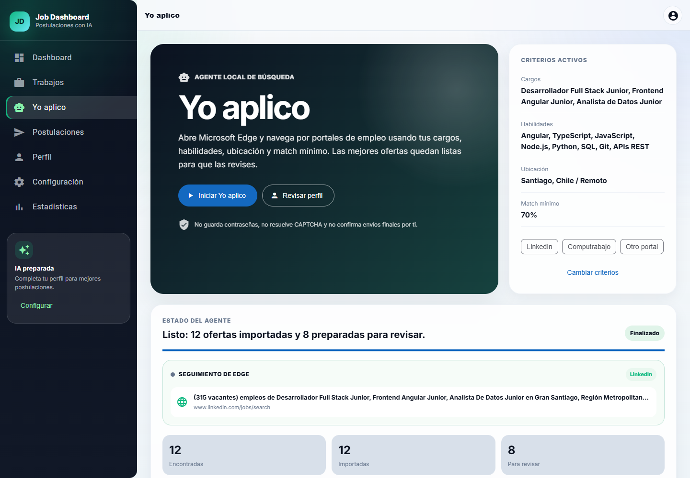
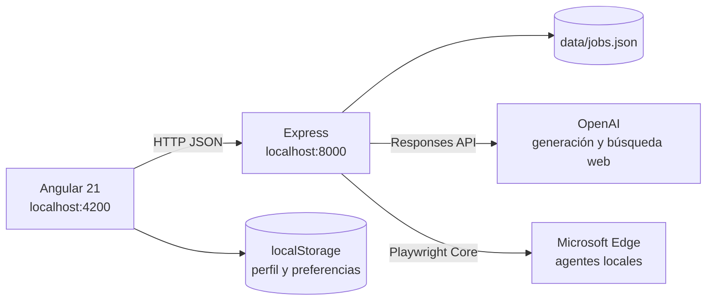

# Postular App

Aplicación web local para descubrir ofertas laborales, medir su compatibilidad con el perfil del candidato y gestionar postulaciones con apoyo de inteligencia artificial.

Postular App reúne en un solo flujo la búsqueda de oportunidades, la preparación de correos, mensajes de LinkedIn y CV adaptados, y el seguimiento de cada postulación. Está pensada para mantener a la persona en control: permite revisar la información antes de enviarla y no almacena credenciales de portales de empleo.


## Contenido

- [Funciones principales](#funciones-principales)
- [Cómo funciona](#cómo-funciona)
- [Arquitectura](#arquitectura)
- [Requisitos](#requisitos)
- [Inicio rápido](#inicio-rápido)
- [Configuración](#configuración)
- [Modo de demostración](#modo-de-demostración)
- [API](#api)
- [Estructura del proyecto](#estructura-del-proyecto)
- [Scripts y pruebas](#scripts-y-pruebas)
- [Seguridad y limitaciones](#seguridad-y-limitaciones)
- [Solución de problemas](#solución-de-problemas)

## Funciones principales

- Dashboard con indicadores de oportunidades y postulaciones.
- Descubrimiento de ofertas mediante IA y búsqueda web.
- Importación y almacenamiento local de trabajos.
- Ordenamiento por porcentaje de compatibilidad.
- Filtros por texto, tecnología, ubicación y score mínimo.
- Perfil profesional reutilizable para generar postulaciones.
- Generación de correo, mensaje de LinkedIn y CV ATS adaptado.
- Selección de LinkedIn, Computrabajo y otros portales.
- Preparación por lote según plataforma y match mínimo.
- Agente local **Yo aplico** que busca e importa ofertas públicas desde Microsoft Edge.
- Flujo de postulación manual o automática para formularios compatibles.
- Cola con estados `Lista para revisar` y `Enviada`.
- Estadísticas de postulaciones por fecha.
- Fallback de demostración cuando la API de OpenAI no está disponible.

## Cómo funciona

1. Completa tu información en **Perfil**.
2. Configura las plataformas y el match mínimo en **Configuración**.
3. Descubre o importa ofertas desde **Trabajos**.
4. Presiona **Preparar seleccionadas** para crear la cola.
5. En **Postulaciones**, revisa cada oportunidad preparada.
6. Genera y edita el correo, mensaje y CV.
7. Continúa manualmente en el portal o inicia la postulación automática.
8. Confirma el resultado y consulta el avance en **Estadísticas**.

> **Importante:** **Yo aplico** solo busca e importa ofertas. La postulación automática se inicia por separado desde **Postulaciones** y puede pulsar el envío final únicamente cuando reconoce un formulario compatible. Los inicios de sesión, CAPTCHA y preguntas personales requieren intervención del usuario.

## Guía visual de Yo aplico



Consulta la [guía completa de Yo aplico](docs/YO_APLICO.md) para configurar el perfil, ejecutar la búsqueda en Edge, revisar la cola y elegir entre envío manual o automático.

## Capturas

### Trabajos


### Perfil


### Estadísticas


## Arquitectura



| Capa | Tecnología | Responsabilidad |
| --- | --- | --- |
| Frontend | Angular 21, Angular Material y SCSS | Interfaz, navegación y estado local |
| Gráficos | Chart.js y ng2-charts | Estadísticas de postulaciones |
| Backend | Node.js y Express | API, validación y coordinación de agentes |
| Inteligencia artificial | OpenAI Responses API | Generación de contenido y búsqueda web |
| Automatización | Playwright Core y Microsoft Edge | Búsqueda e interacción con portales |
| Persistencia | JSON local y `localStorage` | Ofertas, estados, perfil y preferencias |

## Requisitos

- Node.js 20 o superior.
- npm.
- Microsoft Edge instalado para utilizar **Yo aplico** y la postulación automática.
- Una `OPENAI_API_KEY` con cuota disponible para utilizar las funciones reales de IA.

También puedes ejecutar el proyecto sin una API key válida utilizando el modo de demostración.

## Inicio rápido

Los ejemplos están escritos para PowerShell en Windows. Ejecuta cada bloque desde la raíz del repositorio.

### Backend

```powershell
cd job-backend
npm.cmd ci
Copy-Item .env.example .env
```

Configura `job-backend/.env`:

```env
OPENAI_API_KEY=tu_api_key
PORT=8000
MOCK_ON_QUOTA=1
```

`OPENAI_API_KEY` es necesaria para usar IA real. Si solo quieres probar la aplicación, puedes dejar la key sin configurar y activar `MOCK_ON_QUOTA=1`.

Inicia el servidor:

```powershell
npm.cmd run dev
```

Comprueba el estado del backend:

```powershell
curl.exe http://localhost:8000/health
```

### Frontend

Abre otra terminal:

```powershell
cd job-dashboard
npm.cmd ci
npm.cmd start
```

La aplicación estará disponible en [http://localhost:4200](http://localhost:4200).

El frontend consume por defecto `http://localhost:8000`. Si modificas el puerto del backend, actualiza `job-dashboard/src/app/core/config/api-base-url.ts`.

## Configuración

### Variables de entorno del backend

| Variable | Obligatoria | Valor predeterminado | Uso |
| --- | --- | --- | --- |
| `OPENAI_API_KEY` | Solo para IA real | — | Credencial de OpenAI; debe permanecer en el backend |
| `OPENAI_MODEL` | No | `gpt-4.1-mini` | Modelo usado para descubrir ofertas y generar contenido |
| `PORT` | No | `8000` | Puerto HTTP del backend |
| `MOCK_ON_QUOTA` | No | Desactivado | Activa la demo si falta la key, no hay cuota o se alcanza el rate limit |
| `JOB_DATA_PATH` | No | `job-backend/data/jobs.json` | Ruta alternativa para el archivo de persistencia |

### Preferencias de postulación

En la pantalla **Configuración** puedes definir:

- Plataformas permitidas: LinkedIn, Computrabajo y otros portales.
- Match mínimo requerido para entrar en la cola.
- Tecnología y ubicación preferidas.
- Visibilidad predeterminada de ofertas ya postuladas.

El botón **Preparar seleccionadas** procesa hasta 10 ofertas no postuladas que cumplan las preferencias. El backend detecta la plataforma a partir del dominio y guarda el estado `ready_for_review`.

El perfil y las preferencias se guardan en el `localStorage` del navegador. Las ofertas y sus estados se almacenan en `job-backend/data/jobs.json`.

## Modo de demostración

Configura la siguiente variable cuando no tengas crédito disponible en OpenAI:

```env
MOCK_ON_QUOTA=1
```

Cuando la API key falta, no tiene cuota o alcanza un límite de solicitudes:

- `/discover` entrega oportunidades simuladas con enlaces de búsqueda.
- `/generate` crea un correo, mensaje y CV de ejemplo usando el perfil local.
- La configuración, cola y seguimiento continúan funcionando normalmente.

## API

| Método | Ruta | Descripción |
| --- | --- | --- |
| `GET` | `/health` | Comprueba el estado del backend |
| `GET` | `/application-platforms` | Lista las plataformas compatibles |
| `GET` | `/jobs` | Obtiene las ofertas guardadas |
| `POST` | `/jobs` | Importa una oferta y evita duplicados por URL |
| `PUT` | `/jobs/:id/apply` | Marca una postulación como enviada |
| `POST` | `/applications/prepare-batch` | Prepara ofertas según plataforma y score |
| `POST` | `/generate` | Genera correo, mensaje y CV con IA |
| `POST` | `/discover` | Descubre ofertas mediante IA y búsqueda web |
| `POST` | `/browser-agent/start` | Inicia una búsqueda local con **Yo aplico** |
| `GET` | `/browser-agent/status/:id` | Consulta el avance de **Yo aplico** |
| `POST` | `/applications/:id/auto-apply` | Inicia una postulación automática |
| `GET` | `/application-agent/status/:id` | Consulta el avance de la postulación automática |

Ejemplo para preparar una cola:

```json
{
  "platforms": ["linkedin", "computrabajo"],
  "min_score": 70,
  "limit": 10,
  "profile": {
    "fullName": "Nombre Apellido",
    "email": "correo@ejemplo.com"
  }
}
```

## Estructura del proyecto

```text
Postular_app/
├── job-backend/
│   ├── data/                   # Persistencia JSON local
│   ├── src/
│   │   ├── application-agent.mjs
│   │   ├── application-platforms.mjs
│   │   ├── browser-agent.mjs
│   │   ├── openai.mjs
│   │   ├── server.mjs
│   │   └── store.mjs
│   ├── test/
│   └── package.json
├── job-dashboard/
│   ├── public/
│   ├── src/app/
│   │   ├── core/               # Configuración, HTTP y layout
│   │   └── features/           # Pantallas por dominio
│   └── package.json
├── docs/
│   ├── images/
│   └── YO_APLICO.md
└── README.md
```

## Scripts y pruebas

### Backend

Ejecuta estos comandos desde `job-backend`:

| Comando | Descripción |
| --- | --- |
| `npm.cmd run dev` | Inicia el servidor |
| `npm.cmd run dev:watch` | Inicia el servidor con recarga automática |
| `npm.cmd start` | Inicia el servidor sin modo watch |
| `npm.cmd test` | Ejecuta las pruebas con el test runner de Node.js |

### Frontend

Ejecuta estos comandos desde `job-dashboard`:

| Comando | Descripción |
| --- | --- |
| `npm.cmd start` | Inicia el servidor de desarrollo |
| `npm.cmd run build` | Genera el build de producción |
| `npm.cmd run watch` | Compila en modo desarrollo y observa cambios |
| `npm.cmd test` | Ejecuta las pruebas con Vitest |

Validación recomendada antes de integrar cambios:

```powershell
cd job-backend
npm.cmd test

cd ..\job-dashboard
npm.cmd test -- --watch=false
npm.cmd run build
```

## Seguridad y limitaciones

- La `OPENAI_API_KEY` solo debe existir en `job-backend/.env`.
- No publiques archivos `.env` ni claves privadas.
- El perfil se guarda localmente en el navegador.
- Las ofertas y estados se almacenan en `job-backend/data/jobs.json`.
- La aplicación no almacena contraseñas de LinkedIn, Computrabajo u otros portales.
- Los inicios de sesión, CAPTCHA, pretensión salarial y preguntas personales deben resolverse en la ventana del navegador.
- **Yo aplico** no envía postulaciones: solo busca e importa oportunidades.
- La postulación automática requiere una acción explícita y solo funciona con formularios reconocidos por el agente.
- Antes de enviar datos, revisa la oferta, el material generado y las condiciones del portal.
- Usa automatización únicamente donde los términos del portal y la normativa aplicable lo permitan.

## Solución de problemas

### `net::ERR_CONNECTION_REFUSED :8000`

El backend no está ejecutándose o utiliza otro puerto:

```powershell
cd job-backend
npm.cmd run dev
```

### `429 insufficient_quota`

La cuenta de OpenAI no tiene crédito disponible. Habilita billing o configura `MOCK_ON_QUOTA=1`.

### La cola queda vacía

Comprueba que:

- El perfil tenga nombre y correo.
- Existan ofertas sin postular.
- La plataforma esté seleccionada.
- El score de la oferta sea igual o superior al mínimo configurado.

### Edge no se abre o aparece `ERR_NETWORK_ACCESS_DENIED`

Verifica que Microsoft Edge esté instalado e inicia el backend desde una terminal local con permiso para abrir aplicaciones y acceder a Internet. Luego recarga el frontend.

### Error `chrome-extension://`

Generalmente proviene de una extensión instalada en el navegador. Prueba en modo incógnito o desactiva temporalmente las extensiones.

### `node --watch` falla con `spawn EPERM`

Usa `npm.cmd run dev`, que inicia el backend sin observación automática de archivos.
