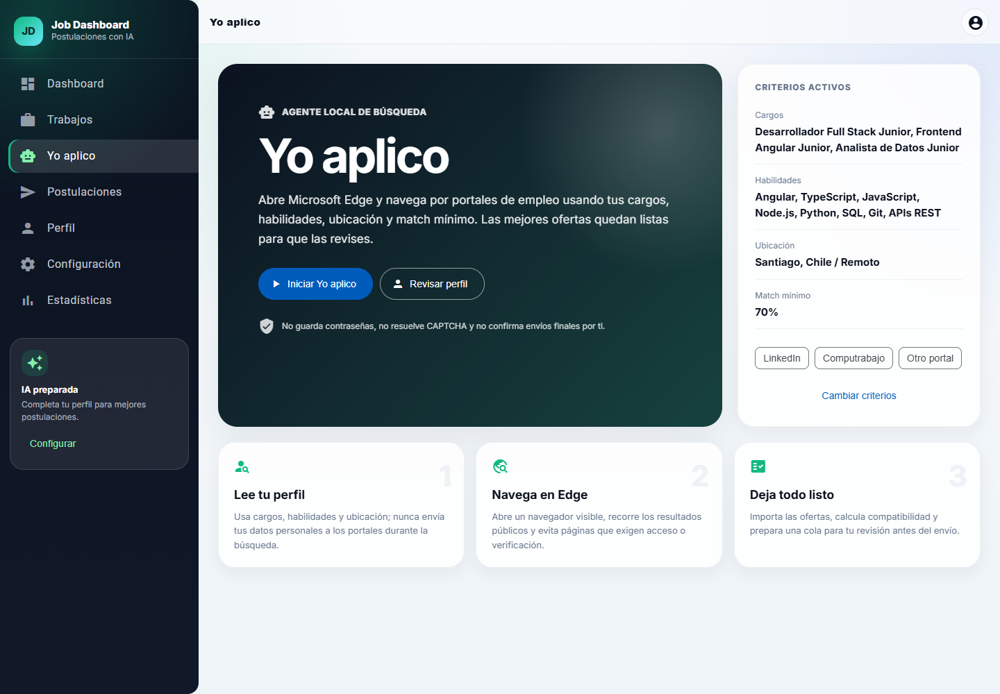
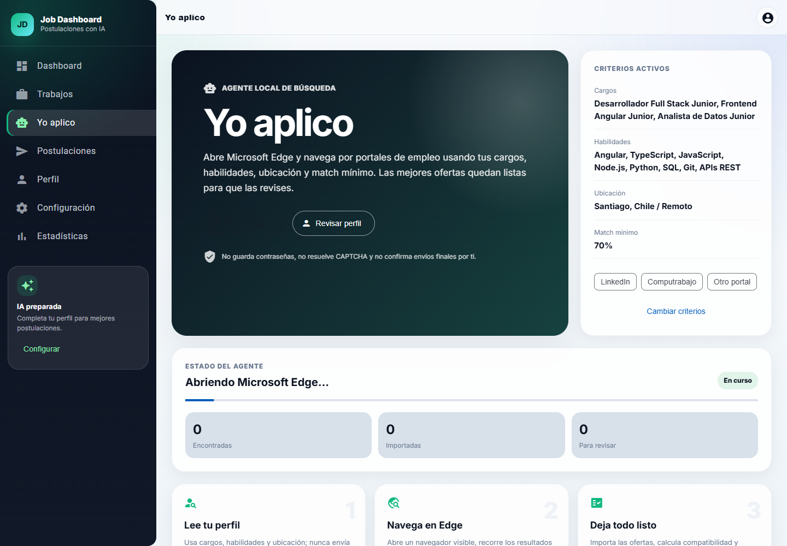
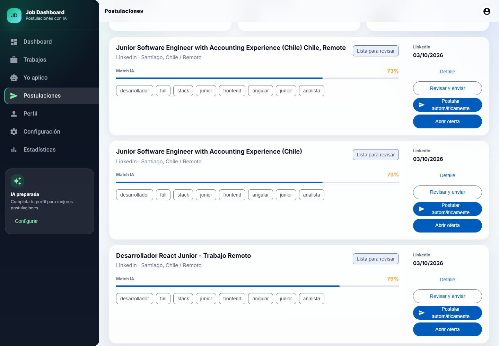

# Guía de uso: Yo aplico

`Yo aplico` abre Microsoft Edge, busca ofertas públicas con los datos de tu perfil, importa los resultados y deja las coincidencias que superan el match mínimo en la cola de revisión.

> Importante: **Yo aplico no envía postulaciones**. El envío se realiza después, desde **Postulaciones**, mediante **Revisar y enviar** o **Postular automáticamente**. Este último botón sí puede pulsar el envío final cuando el portal muestra un formulario compatible.

## 1. Iniciar la aplicación

Necesitas Node.js 20 o superior, npm y Microsoft Edge instalado.

En una terminal, inicia el backend:

```powershell
cd job-backend
npm.cmd install
Copy-Item .env.example .env
npm.cmd run dev
```

Comprueba que responde:

```powershell
curl.exe http://localhost:8000/health
```

En otra terminal, inicia el frontend:

```powershell
cd job-dashboard
npm.cmd install
npm.cmd start
```

Abre [http://localhost:4200/yo-aplico](http://localhost:4200/yo-aplico).

## 2. Completar el perfil

En **Perfil**, guarda como mínimo:

- Nombre completo y email.
- Uno o más cargos objetivo o habilidades.
- Ubicación, experiencia y tecnologías para mejorar la búsqueda y el match.

El perfil se guarda localmente en el navegador. La experiencia actual debe escribirse con un período claro, por ejemplo: `Analista de Admisión — agosto de 2026 a la actualidad`.

## 3. Configurar los criterios

En **Configuración**, selecciona:

- Las plataformas que quieres consultar: LinkedIn, Computrabajo u otros portales.
- El match mínimo para preparar una oferta.
- La tecnología y ubicación preferidas.

Antes de comenzar, **Yo aplico** muestra un resumen de los criterios activos. Si algo no corresponde, usa **Cambiar criterios**.



## 4. Ejecutar Yo aplico

Pulsa **Iniciar Yo aplico** y mantén abierta la ventana de Microsoft Edge que aparece. La aplicación mostrará el avance y el portal que está visitando.



Durante esta etapa, el agente:

1. Lee los cargos, habilidades, ubicación y match mínimo.
2. Recorre resultados públicos en los portales seleccionados.
3. Importa ofertas nuevas y evita duplicados por enlace.
4. Calcula su compatibilidad y prepara las que superan el mínimo.

No guarda contraseñas, no intenta resolver CAPTCHA y evita las páginas que requieren una verificación durante la búsqueda.

## 5. Revisar el resultado

Al finalizar verás tres contadores:

- **Encontradas:** resultados leídos en los portales.
- **Importadas:** ofertas nuevas guardadas en la aplicación.
- **Para revisar:** ofertas que superaron el match mínimo y entraron en la cola.

Los valores varían en cada ejecución. La siguiente captura corresponde a una ejecución real de demostración.


Pulsa **Revisar postulaciones** para abrir la cola.

## 6. Elegir cómo postular

En **Postulaciones**, revisa el cargo, la empresa, el match y los requisitos reales antes de enviar datos.



Cada oferta disponible tiene estas opciones:

- **Detalle:** muestra toda la información importada.
- **Revisar y enviar:** permite revisar el material generado y continuar manualmente.
- **Postular automáticamente:** abre el portal en Edge, completa campos reconocibles y puede pulsar el botón final de envío si detecta una confirmación compatible.
- **Abrir oferta:** abre el anuncio original.

Usa **Postular automáticamente** solo después de revisar esa oferta concreta. Mantén Edge abierto y completa allí cualquier inicio de sesión, CAPTCHA, pretensión salarial o pregunta personal que el agente no pueda responder. La aplicación solo marca la postulación como enviada cuando el portal muestra una confirmación reconocible.

## Problemas comunes

### La app solicita completar el perfil

Comprueba que **Nombre completo** y **Email** estén guardados y que exista al menos un cargo objetivo, una habilidad o una tecnología preferida.

### El frontend no conecta con el backend

Verifica el servicio:

```powershell
curl.exe http://localhost:8000/health
```

Si no responde, inicia de nuevo `job-backend` con `npm.cmd run dev`.

### Edge no se abre o aparece `ERR_NETWORK_ACCESS_DENIED`

Inicia el backend desde una terminal local normal que permita abrir Microsoft Edge y acceder a Internet. Después recarga el frontend e inténtalo nuevamente.

### No se encuentran ofertas nuevas

- Amplía los cargos objetivo.
- Reduce el match mínimo.
- Usa una ubicación menos restrictiva o `Remoto`.
- Comprueba que haya al menos una plataforma seleccionada.
- Recuerda que los resultados públicos disponibles cambian con el tiempo.

### El portal pide login, CAPTCHA o respuestas obligatorias

Completa esos pasos directamente en la ventana de Edge. El agente espera la intervención del usuario y continúa cuando el formulario vuelve a estar disponible.

## Datos y seguridad

- El perfil se almacena en el `localStorage` del navegador.
- Las ofertas y estados se guardan en `job-backend/data/jobs.json`.
- La clave de OpenAI, si se usa, debe permanecer únicamente en `job-backend/.env`.
- Nunca publiques `.env`, contraseñas ni capturas que expongan datos personales.
- Las capturas de esta guía usan un perfil de demostración.
